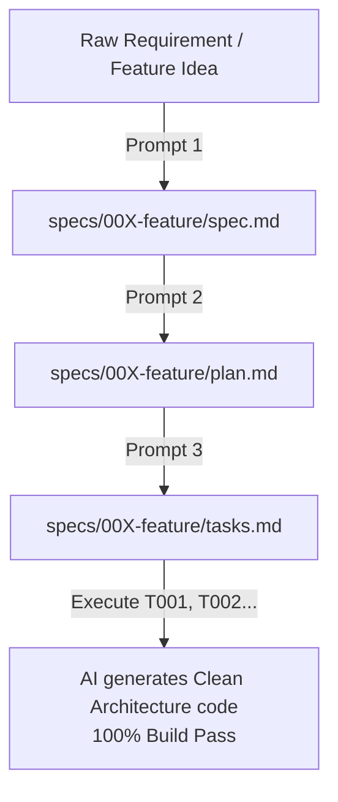

# Spec-Driven Development Workflow & Standard Prompts: EngComic_backend

The **Spec-Driven Development (SDD)** model helps developers and AI collaborate seamlessly through a standardized 3-step lifecycle: `spec.md` $\rightarrow$ `plan.md` $\rightarrow$ `tasks.md` $\rightarrow$ `code`.

---

## 1. Classification of Project Files

| File Category | File Name | File Location | Role & Purpose |
| :--- | :--- | :--- | :--- |
| **Shared** *(Created once)* | [AGENTS.md](file:///c:/Data/code/tieu_luan_chuyen_nganh/source_code/back-end/AGENTS.md) | Root folder (`/`) | Immutable rules: Tech stack, Clean Architecture, 3 immutable principles, compile commands. |
| **Shared** *(Created once)* | `docs/` | `docs/*.md` | Foundation documentation: Architecture, Data model, API contracts, Tech stack upgrade plan. |
| **New Feature** *(Step 1)* | `spec.md` | `specs/{###-feature}/spec.md` | Defines User Stories (P1, P2), BDD Acceptance Criteria (`Given - When - Then`). |
| **New Feature** *(Step 2)* | `plan.md` | `specs/{###-feature}/plan.md` | Technical design: MongoDB Schema, Boundary Interfaces, Interactors, DTOs, API URLs. |
| **New Feature** *(Step 3)* | `tasks.md` | `specs/{###-feature}/tasks.md` | Independent checklist with `[ ]` checkboxes, specifying `Where`, `How`, `Refs`. |

---

## 2. Standard 3-Prompt Sequence for Feature Generation

When starting any new feature, simply copy and execute the **3 Sequential Prompts**:



---

### 🟢 STEP 1: Prompt to Generate `spec.md` (Raw Requirements $\rightarrow$ Detailed Specification)

```markdown
I want to develop a new feature for EngComic_backend: "[Feature Name, e.g. Daily Attendance Check-in & Card Reward System]".
Here is the initial description:
[Paste business requirement description / meeting notes / idea here]

Act as a Senior Product Owner / Business Analyst and create the file `specs/[feature-id]/spec.md` using the following structure:
1. Analyze User Stories ordered by priority (P1, P2, P3).
2. Each User Story must include:
   - User Journey description.
   - Priority rationale (Why this priority).
   - Independent Test criteria.
   - Detailed Acceptance Scenarios in BDD format (Given - When - Then), including happy path, error handling, validation, and authorization.
3. List of business invariants and edge cases to handle.
```

---

### 🟡 STEP 2: Prompt to Generate `plan.md` (`spec.md` $\rightarrow$ Technical Design Document)

```markdown
Based on the specification `specs/[feature-id]/spec.md` and the Clean Architecture guidelines in `AGENTS.md` / `docs/architecture.md`, act as a Solution Architect and create `specs/[feature-id]/plan.md`.

The technical plan must include:
1. **Technical Context**: Identify affected packages and layers in `src/main/java/mobile/`.
2. **Data Model**: Design MongoDB Entities/Collections (`@Document`, `@Id ObjectId`), fields (type, nullable, default), and references.
3. **Boundary Contracts**: Define Use-Case Boundary Interfaces (`mobile.businesses.boundaries.[feature]`) with inner Request/Response classes.
4. **API Contracts & DTOs**: Define endpoint URLs, HTTP Methods, RequestDto (`@NotBlank`, `@NotNull`, `@Min`), ResponseDto, and Error codes.
5. **Sequence Flow**: Mermaid diagram mapping Controller -> Boundary -> Interactor -> Repository -> MongoDB.
6. **Security & Concurrency**: Role permissions (`USER`, `ADMIN`) and concurrency control.
```

---

### 🔴 STEP 3: Prompt to Generate `tasks.md` (`plan.md` $\rightarrow$ AI Execution Checklist)

```markdown
Based on `specs/[feature-id]/spec.md` and `specs/[feature-id]/plan.md`, create `specs/[feature-id]/tasks.md` breaking down work into independent checklist tasks.

Divide into 4 Phases:
- **Phase 1: Database & Persistence Layer**: Create MongoDB Entity in `mobile.databases.entities`, Repository in `mobile.databases.repositories`.
- **Phase 2: Business Logic & Use-Case Layer**: Create Boundary Interfaces in `mobile.businesses.boundaries`, Interactors in `mobile.businesses.interactors`.
- **Phase 3: Adapter & REST API Layer**: Create Request/Response DTOs, Mappers, and Controllers in `mobile.apis.[feature]`.
- **Phase 4: Verification & Testing**: Run `./mvnw compile` to verify compilation and write unit/integration tests.

Task formatting requirement:
- [ ] `T00X` [Action summary]:
  - **Where**: Specific file path to create/edit.
  - **How**: Logic summary (patterns, annotations).
  - **Refs**: Reference to `spec.md` or `plan.md`.
```

---

## 3. Execution Commands

Once all 3 files exist in `specs/[feature-id]/`, instruct the AI to execute tasks step by step:

> **Example Command:**  
> *"Read `specs/001-daily-checkin/` and execute Task `T001` in `tasks.md`. Upon completion, mark `[x]` in `tasks.md` and run `./mvnw compile` to verify syntax."*

---

## 4. Summary of Benefits

1. **Prevents Context Window Overflow**: AI only processes 1 feature context and 1 task at a time.
2. **Eliminates Hallucination**: AI is strictly bound by business logic defined in `spec.md` and `plan.md`.
3. **Protects Architectural Integrity**: AI consistently generates code adhering to Clean Architecture layers (`apis`, `businesses`, `databases`) without side effects.
