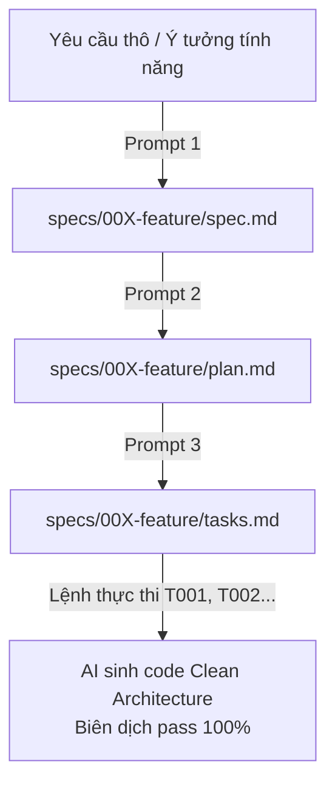

# Spec-Driven Development Workflow & Standard Prompts: EngComic_backend

Mô hình **Spec-Driven Development (SDD)** giúp lập trình viên và AI phối hợp nhịp nhàng qua chu trình 3 bước chuẩn hóa: `spec.md` $\rightarrow$ `plan.md` $\rightarrow$ `tasks.md` $\rightarrow$ `code`.

---

## 1. Phân loại 2 nhóm File trong Dự án

| Loại File | Tên File | Vị trí lưu | Vai trò |
| :--- | :--- | :--- | :--- |
| **Dùng chung** *(Tạo 1 lần)* | [AGENTS.md](file:///d:/Others/my-projects/EngComic_backend/AGENTS.md) | Thư mục gốc (`/`) | Luật bất biến: Tech stack, Clean Architecture, 3 nguyên tắc bất biến, lệnh compile. |
| **Dùng chung** *(Tạo 1 lần)* | `docs/` | `docs/*.md` | Tài liệu nền tảng: Kiến trúc, Data model, API contracts, Kế hoạch nâng cấp Tech stack. |
| **Feature Mới** *(Bước 1)* | `spec.md` | `specs/{###-feature}/spec.md` | Định nghĩa User Stories (P1, P2), Tiêu chí nghiệm thu BDD (`Given - When - Then`). |
| **Feature Mới** *(Bước 2)* | `plan.md` | `specs/{###-feature}/plan.md` | Thiết kế kỹ thuật: MongoDB Schema, Boundary Interfaces, Interactors, DTOs, API URLs. |
| **Feature Mới** *(Bước 3)* | `tasks.md` | `specs/{###-feature}/tasks.md` | Danh sách task độc lập có checkbox `[ ]`, chỉ rõ `Where`, `How`, `Refs`. |

---

## 2. Bộ 3 Prompt Chuẩn để Generate từng Bước

Khi bắt đầu làm bất kỳ tính năng mới nào, bạn chỉ cần copy và chạy **3 Prompt tuần tự**:



---

### 🟢 BƯỚC 1: Prompt sinh `spec.md` (Từ Yêu cầu thô $\rightarrow$ Đặc tả chi tiết)

```markdown
Tôi muốn phát triển tính năng mới cho EngComic_backend: "[Tên tính năng, ví dụ: Hệ thống Điểm danh Hàng ngày & Nhận Thẻ Bài]".
Dưới đây là mô tả sơ bộ:
[Dán mô tả yêu cầu nghiệp vụ / ghi chú họp / ý tưởng vào đây]

Hãy đóng vai trò Senior Product Owner / Business Analyst và tạo file `specs/[mã-feature]/spec.md` theo cấu trúc:
1. Phân tích các User Stories theo thứ tự ưu tiên (P1, P2, P3).
2. Mỗi User Story phải có:
   - Mô tả hành trình người dùng (User Journey).
   - Lý do ưu tiên (Why this priority).
   - Cách test độc lập (Independent Test).
   - Danh sách Acceptance Scenarios chi tiết theo định dạng BDD (Given - When - Then), bao gồm cả luồng thành công (Happy path), luồng lỗi, validation và phân quyền.
3. Danh sách các quy tắc nghiệp vụ bất biến (Business Invariants) và các Edge cases cần lưu ý.
```

---

### 🟡 BƯỚC 2: Prompt sinh `plan.md` (Từ `spec.md` $\rightarrow$ Bản Thiết kế Kỹ thuật)

```markdown
Dựa vào file đặc tả `specs/[mã-feature]/spec.md` và các quy chuẩn Clean Architecture trong `AGENTS.md` / `docs/architecture.md`, hãy đóng vai trò Solution Architect và tạo file `specs/[mã-feature]/plan.md`.

Bản thiết kế cần bao gồm:
1. **Technical Context**: Xác định các layer và package cần tác động trong `src/main/java/mobile/`.
2. **Data Model**: Thiết kế MongoDB Entities/Collections (`@Document`, `@Id ObjectId`), các trường (kiểu dữ liệu, nullable, default), quan hệ `@DBRef` hoặc reference ID.
3. **Boundary Contracts**: Định nghĩa các Use-Case Boundary Interfaces (`mobile.businesses.boundaries.[feature]`) kèm lồng Request/Response.
4. **API Contracts & DTOs**: Định nghĩa URL endpoint, HTTP Methods, RequestDto (`@NotBlank`, `@NotNull`, `@Min`), ResponseDto và Error codes.
5. **Sequence Flow**: Sơ đồ Mermaid mô tả thứ tự gọi từ Controller -> Boundary -> Interactor -> Repository -> MongoDB.
6. **Security & Concurrency**: Phân quyền Role (`USER`, `ADMIN`), kiểm soát điều kiện đồng thời.
```

---

### 🔴 BƯỚC 3: Prompt sinh `tasks.md` (Từ `plan.md` $\rightarrow$ Checklist thực thi cho AI)

```markdown
Dựa vào file `specs/[mã-feature]/spec.md` và `specs/[mã-feature]/plan.md`, hãy tạo file `specs/[mã-feature]/tasks.md` để chia nhỏ công việc thành các task độc lập theo định dạng checklist.

Yêu cầu phân chia thành 4 Phase:
- **Phase 1: Database & Persistence Layer**: Tạo MongoDB Entity trong `mobile.databases.entities`, Repository trong `mobile.databases.repositories`.
- **Phase 2: Business Logic & Use-Case Layer**: Tạo Boundary Interfaces trong `mobile.businesses.boundaries`, Interactors trong `mobile.businesses.interactors`.
- **Phase 3: Adapter & REST API Layer**: Tạo Request/Response DTOs, Mapper và Controller trong `mobile.apis.[feature]`.
- **Phase 4: Verification & Testing**: Chạy `./mvnw compile` kiểm tra biên dịch và viết Unit/Integration test.

Định dạng mỗi task bắt buộc:
- [ ] `T00X` [Mô tả ngắn gọn hành động]:
  - **Where**: Đường dẫn file cụ thể cần tạo/sửa.
  - **How**: Tóm tắt logic cần viết (áp dụng pattern nào, annotations gì).
  - **Refs**: Tham chiếu tới mục tương ứng trong `spec.md` hoặc `plan.md`.
```

---

## 3. Lệnh Thực thi Code Từng Bước (Execution)

Sau khi đã có đủ bộ 3 file trong thư mục `specs/[mã-feature]/`, bạn chỉ cần ra lệnh ngắn gọn cho AI thực hiện từng task:

> **Lệnh mẫu:**  
> *"Hãy đọc `specs/001-daily-checkin/` và thực hiện Task `T001` trong `tasks.md`. Sau khi hoàn thành, hãy tự động đánh dấu `[x]` vào `tasks.md` và chạy `./mvnw compile` để kiểm tra lỗi cú pháp."*

---

## 4. Tóm tắt Lợi ích của Quy trình

1. **Không bao giờ bị tràn Context Window**: AI chỉ nhận ngữ cảnh của 1 feature và làm 1 task nhỏ tại 1 thời điểm.
2. **Loại bỏ Hallucination**: AI không thể tự "bịa" ra logic nghiệp vụ vì đã bị ràng buộc chặt chẽ bởi `spec.md` và `plan.md`.
3. **Bảo vệ toàn vẹn kiến trúc**: AI luôn sinh code đúng các tầng Clean Architecture (`apis`, `businesses`, `databases`) mà không làm ảnh hưởng đến code cũ.
