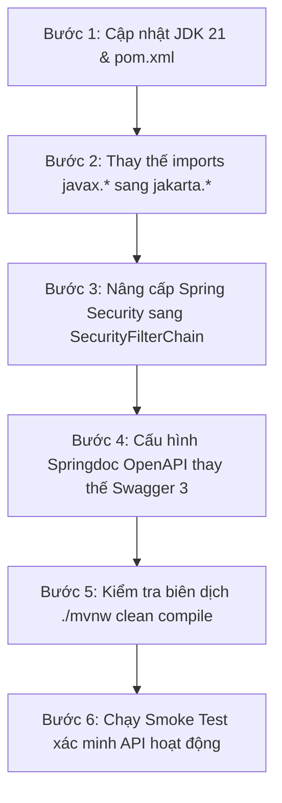

# Tech Stack Modernization & Upgrade Plan: EngComic_backend

> **Mục tiêu**: Nâng cấp từ **Java 11 + Spring Boot 2.6.2** lên **Java 21 + Spring Boot 3.3.x**  
> **Lợi ích cốt lõi**:
> 1. Tận dụng **Java 21 `record`** để viết DTO và Use-Case Boundaries siêu ngắn gọn (giảm 70% boilerplate của Clean Architecture).
> 2. Thay thế **Springfox Swagger 3.0.0 đã chết** bằng **Springdoc OpenAPI 3**.
> 3. Cập nhật **Spring Security 6** với `SecurityFilterChain` bean hiện đại.
> 4. Hiệu năng vượt trội nhờ **Virtual Threads** và các bản vá bảo mật mới nhất.

---

## 1. So sánh Thay đổi Dependency (`pom.xml`)

| Thành phần | Trước nâng cấp (Hiện tại) | Sau nâng cấp (Mục tiêu) |
| :--- | :--- | :--- |
| **Java Version** | `<java.version>11</java.version>` | `<java.version>21</java.version>` |
| **Spring Boot Parent** | `2.6.2` | `3.3.2` (hoặc `3.3.x` mới nhất) |
| **Servlet & Validation Namespace** | `javax.*` (`javax.servlet`, `javax.validation`) | `jakarta.*` (`jakarta.servlet`, `jakarta.validation`) |
| **Swagger / OpenAPI** | `springfox-boot-starter:3.0.0` (Bị bỏ rơi) | `springdoc-openapi-starter-webmvc-ui:2.5.0` |
| **JWT Library** | `java-jwt:3.18.3` & `jjwt:0.9.1` (trộn lẫn) | Chuẩn hóa `com.auth0:java-jwt:4.4.0` |
| **Cloudinary** | `cloudinary-http5:2.0.0` | `cloudinary-http5:2.0.0` |
| **Lombok** | `org.projectlombok:lombok` | `org.projectlombok:lombok` (bản mới nhất tương thích JDK 21) |

---

## 2. Các bước Thực hiện Nâng cấp (Step-by-Step Migration)



### Bước 1: Cập nhật `pom.xml`
- Nâng `spring-boot-starter-parent` lên `3.3.2`.
- Đổi `<java.version>21</java.version>`.
- Gỡ bỏ `springfox-boot-starter`, `springfox-swagger-ui`.
- Thêm `springdoc-openapi-starter-webmvc-ui`.

### Bước 2: Refactor Imports (`javax.*` $\rightarrow$ `jakarta.*`)
Thay thế toàn bộ các import:
```diff
- import javax.validation.constraints.NotBlank;
- import javax.validation.constraints.NotNull;
- import javax.servlet.http.HttpServletRequest;
- import javax.servlet.FilterChain;
+ import jakarta.validation.constraints.NotBlank;
+ import jakarta.validation.constraints.NotNull;
+ import jakarta.servlet.http.HttpServletRequest;
+ import jakarta.servlet.FilterChain;
```

### Bước 3: Nâng cấp Spring Security (`SecurityConfiguration.java`)
Bỏ `WebSecurityConfigurerAdapter` đã bị gỡ trong Spring Security 6:
```java
@Configuration
@EnableWebSecurity
@RequiredArgsConstructor
public class SecurityConfiguration {

    private final JwtAuthorizationFilter jwtAuthorizationFilter;

    @Bean
    public SecurityFilterChain securityFilterChain(HttpSecurity http) throws Exception {
        http
            .cors().and().csrf().disable()
            .sessionManagement().sessionCreationPolicy(SessionCreationPolicy.STATELESS)
            .and()
            .authorizeHttpRequests(auth -> auth
                .requestMatchers("/api/auth/**", "/swagger-ui/**", "/v3/api-docs/**").permitAll()
                .anyRequest().authenticated()
            )
            .addFilterBefore(jwtAuthorizationFilter, UsernamePasswordAuthenticationFilter.class);

        return http.build();
    }

    @Bean
    public PasswordEncoder passwordEncoder() {
        return new BCryptPasswordEncoder();
    }
}
```

### Bước 4: Chuyển đổi Swagger sang Springdoc OpenAPI
- URL Swagger UI mới: `http://localhost:8080/swagger-ui/index.html`
- OpenAPI JSON Spec: `http://localhost:8080/v3/api-docs`

---

## 3. Cách tận dụng Java 21 `record` cho Clean Architecture

Sau khi nâng cấp lên Java 21, toàn bộ các Boundary Request/Response và DTOs có thể viết bằng `record`:

### Ví dụ Boundary Use-Case với `record`:
```java
package mobile.businesses.boundaries.gacha;

import org.bson.types.ObjectId;
import java.util.List;

public interface OpenPackBoundary {
    Response execute(Request request);

    record Request(ObjectId userId, ObjectId packId, int quantity) {}
    record Response(boolean success, List<String> cardNames, int coinsRemaining, String message) {}
}
```
*(Thay thế hoàn toàn 30+ dòng code Lombok trước đây mà vẫn đảm bảo Immutability và Thread-safety).*

---

## 4. Kế hoạch Phân kỳ Thực hiện (Phased Execution)

| Giai đoạn | Nội dung | Thời gian ước tính |
| :--- | :--- | :--- |
| **Giai đoạn 1** | Chuẩn bị môi trường JDK 21 trên máy dev + Update `pom.xml` dependencies | 1 giờ |
| **Giai đoạn 2** | Batch replace `javax.*` $\rightarrow$ `jakarta.*` trong toàn bộ `src/main/java` | 1 giờ |
| **Giai đoạn 3** | Cập nhật `SecurityConfiguration` & `JwtAuthorizationFilter` | 2 giờ |
| **Giai đoạn 4** | Build check `./mvnw clean compile` & chạy Smoke test login/get comics | 2 giờ |
