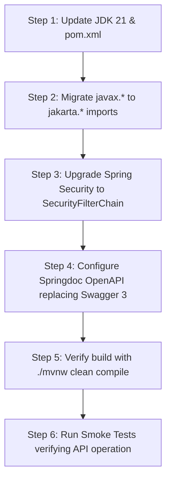

# Tech Stack Modernization & Upgrade Plan: EngComic_backend

> **Objective**: Upgrade from **Java 11 + Spring Boot 2.6.2** to **Java 21 + Spring Boot 3.3.x**  
> **Core Benefits**:
> 1. Leverage **Java 21 `record`** feature to write concise DTOs and Use-Case Boundaries (reducing 70% of Clean Architecture boilerplate code).
> 2. Replace **deprecated Springfox Swagger 3.0.0** with modern **Springdoc OpenAPI 3**.
> 3. Upgrade to **Spring Security 6** with modern `SecurityFilterChain` beans.
> 4. Superior performance powered by **Virtual Threads** and latest security patches.

---

## 1. Dependency Comparison (`pom.xml`)

| Dependency / Component | Current State | Target Upgrade |
| :--- | :--- | :--- |
| **Java Version** | `<java.version>11</java.version>` | `<java.version>21</java.version>` |
| **Spring Boot Parent** | `2.6.2` | `3.3.2` (or latest `3.3.x`) |
| **Servlet & Validation Namespace** | `javax.*` (`javax.servlet`, `javax.validation`) | `jakarta.*` (`jakarta.servlet`, `jakarta.validation`) |
| **Swagger / OpenAPI** | `springfox-boot-starter:3.0.0` (Deprecated) | `springdoc-openapi-starter-webmvc-ui:2.5.0` |
| **JWT Library** | `java-jwt:3.18.3` & `jjwt:0.9.1` (Mixed) | Standardized `com.auth0:java-jwt:4.4.0` |
| **Cloudinary** | `cloudinary-http5:2.0.0` | `cloudinary-http5:2.0.0` |
| **Lombok** | `org.projectlombok:lombok` | `org.projectlombok:lombok` (Latest JDK 21 compatible) |

---

## 2. Step-by-Step Migration Plan



### Step 1: Update `pom.xml`
- Upgrade `spring-boot-starter-parent` to `3.3.2`.
- Update `<java.version>21</java.version>`.
- Remove `springfox-boot-starter`, `springfox-swagger-ui`.
- Add `springdoc-openapi-starter-webmvc-ui`.

### Step 2: Refactor Imports (`javax.*` $\rightarrow$ `jakarta.*`)
Batch replace all imports across the codebase:
```diff
- import javax.validation.constraints.NotBlank;
- import javax.validation.constraints.NotNull;
- import javax.servlet.http.HttpServletRequest;
- import javax.servlet.FilterChain;
+ import jakarta.validation.constraints.NotBlank;
+ import jakarta.validation.constraints.NotNull;
+ import jakarta.servlet.http.HttpServletRequest;
+ import jakarta.servlet.FilterChain;
```

### Step 3: Upgrade Spring Security (`SecurityConfiguration.java`)
Replace deprecated `WebSecurityConfigurerAdapter` removed in Spring Security 6:
```java
@Configuration
@EnableWebSecurity
@RequiredArgsConstructor
public class SecurityConfiguration {

    private final JwtAuthorizationFilter jwtAuthorizationFilter;

    @Bean
    public SecurityFilterChain securityFilterChain(HttpSecurity http) throws Exception {
        http
            .cors().and().csrf().disable()
            .sessionManagement().sessionCreationPolicy(SessionCreationPolicy.STATELESS)
            .and()
            .authorizeHttpRequests(auth -> auth
                .requestMatchers("/api/auth/**", "/swagger-ui/**", "/v3/api-docs/**").permitAll()
                .anyRequest().authenticated()
            )
            .addFilterBefore(jwtAuthorizationFilter, UsernamePasswordAuthenticationFilter.class);

        return http.build();
    }

    @Bean
    public PasswordEncoder passwordEncoder() {
        return new BCryptPasswordEncoder();
    }
}
```

### Step 4: Migrate Swagger to Springdoc OpenAPI
- New Swagger UI URL: `http://localhost:8080/swagger-ui/index.html`
- OpenAPI JSON Spec: `http://localhost:8080/v3/api-docs`

---

## 3. Utilizing Java 21 `record` for Clean Architecture

After upgrading to Java 21, all Boundary Request/Response classes and DTOs can be expressed cleanly using `record`:

### Example Boundary Use-Case with `record`:
```java
package mobile.businesses.boundaries.gacha;

import org.bson.types.ObjectId;
import java.util.List;

public interface OpenPackBoundary {
    Response execute(Request request);

    record Request(ObjectId userId, ObjectId packId, int quantity) {}
    record Response(boolean success, List<String> cardNames, int coinsRemaining, String message) {}
}
```
*(Replaces 30+ lines of verbose Lombok code while guaranteeing immutability and thread safety).*

---

## 4. Phased Execution Roadmap

| Phase | Content / Task | Estimated Duration |
| :--- | :--- | :--- |
| **Phase 1** | Prepare JDK 21 environment on dev machine + Update `pom.xml` dependencies | 1 hour |
| **Phase 2** | Batch replace `javax.*` $\rightarrow$ `jakarta.*` across all `src/main/java` files | 1 hour |
| **Phase 3** | Update `SecurityConfiguration` & `JwtAuthorizationFilter` | 2 hours |
| **Phase 4** | Build verification `./mvnw clean compile` & Smoke test authentication/comic endpoints | 2 hours |
