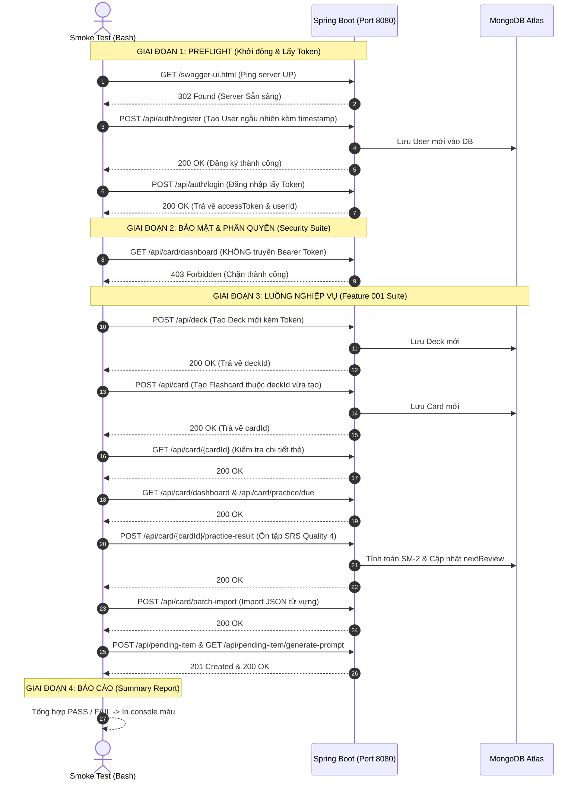

# 🧪 Automated Smoke Test Suite - EngComic_backend

Hệ thống **Black-Box Automation Smoke Test** cho `EngComic_backend` (chạy bằng `bash` + `curl.exe`).  
Smoke Test là bộ kiểm thử nhanh các **luồng sống còn (Critical Path)** của backend ngay sau khi khởi động app nhằm phát hiện lỗi sớm trong vòng **5–10 giây**.

---

## 🏬 1. Luồng Hoạt Động (Life-Cycle & Flow)

Quy trình hoạt động tuần tự qua **4 giai đoạn chính**:



---

## 📂 2. Cấu Trúc File & Trách Nhiệm

```text
scripts/smoke-test/
├── run-smoke.sh             # [ENTRY POINT] Điều phối toàn bộ vòng đời test
├── config.env               # Cấu hình môi trường (BASE_URL, thông tin tài khoản mẫu)
├── README.md                # Tài liệu mô tả kiến trúc & luồng hoạt động
│
├── lib/
│   ├── common.sh            # Hàm helper: log màu, đếm kết quả, hàm wrapper `http_step`
│   └── preflight.sh         # Ping kiểm tra server & tự động đăng ký/đăng nhập lấy JWT Token
│
└── suites/
    ├── security.sh          # Suite kiểm tra bảo mật (truy cập trái phép bị chặn 403)
    └── feature-001.sh       # Suite nghiệp vụ: Deck -> Card -> SRS Ôn tập -> Batch Import -> Collector
```

---

## 🛠️ 3. Cơ Chế Chi Tiết của Hàm `http_step`

Hàm `http_step` trong `common.sh` là trái tim của việc gọi và kiểm tra:

```bash
http_step "Tên bước" METHOD PATH [JSON_BODY] [EXPECTED_HTTP_CODE] [TOKEN]
```

1. **Chuẩn bị Header:** Nếu có `$TOKEN`, tự động gắn `-H "Authorization: Bearer $TOKEN"`.
2. **Gửi HTTP Request:** Dùng `curl.exe` truyền JSON payload qua stdin để tương thích tối đa trên cả Windows / Git Bash / Linux / WSL.
3. **Bóc tách Response:** 
   - Dòng cuối cùng chứa HTTP Status Code (`%{http_code}`).
   - Các dòng trên là JSON Response Body (lưu vào biến `$LAST_BODY`).
4. **Đánh giá Assert:** So sánh Status Code trả về với `$EXPECTED_HTTP_CODE`:
   - Nếu khớp: In `[PASS]` màu xanh và tăng biến `$PASS`.
   - Nếu lệch: In `[FAIL]` màu đỏ, in ra Response Body lỗi và tăng biến `$FAIL`.

---

## 🚀 4. Hướng Dẫn Chạy Smoke Test

### Bước 1: Khởi động Spring Boot Backend
Đảm bảo ứng dụng backend đang chạy tại cổng `8080`:
```powershell
./mvnw spring-boot:run
```

### Bước 2: Thực thi Smoke Test
Mở terminal **Git Bash** (trên Windows) hoặc WSL và chạy:
```bash
./scripts/smoke-test/run-smoke.sh
```

---

## ➕ 5. Cách Thêm Test Suite Cho Tính Năng Mới

Khi làm các feature tiếp theo (ví dụ: `comic`, `novel`, `gacha`), chỉ cần:
1. Tạo file mới trong `suites/feature-xxx.sh` chứa hàm `run_feature_xxx_suite()`.
2. Dùng các lệnh `http_step` để mô tả chuỗi API cần kiểm tra.
3. Import (`source`) và gọi hàm đó trong `run-smoke.sh`.
