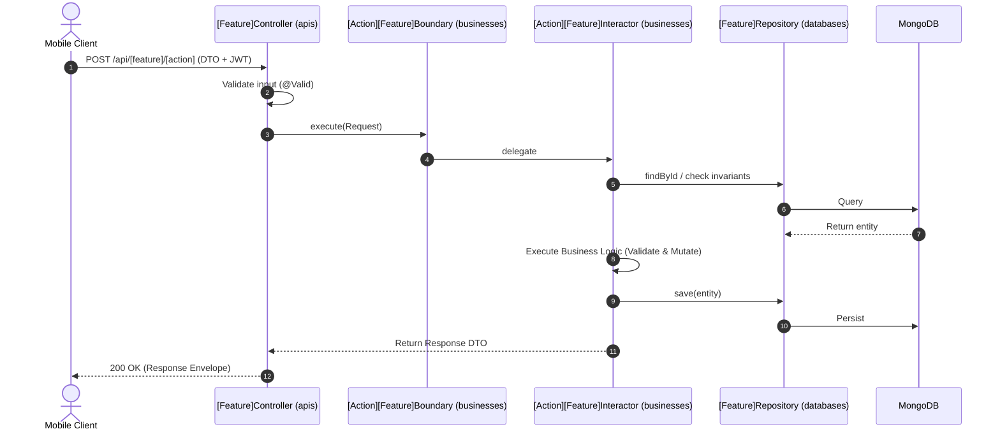

# Implementation Plan: [Feature Name]

> **Perspective**: Tech Lead / System Architect  
> **Purpose**: Answer the question **"HOW & ARCHITECTURE"**

---

## 1. Technical Context & Constraints
- **Package Base**: `mobile.*`
- **Architecture Pattern**: Clean Architecture + Package-by-Feature (`apis` $\rightarrow$ `businesses` $\rightarrow$ `databases`)
- **Database**: MongoDB (`@Document`, `ObjectId`)
- **Validation**: `@Valid`, `@NotBlank`, `@NotNull`, `@Min`, `@Max`
- **Security**: JWT Bearer Token, Spring Security Context

---

## 2. Data Model & Database Schema

### 2.1 MongoDB Collection: `[collection_name]`
- **Entity Class**: `mobile.databases.entities.[Feature]Entity.java`
- **Fields**:
  | Field | Java Type | BSON Type | Constraints | Description |
  | :--- | :--- | :--- | :--- | :--- |
  | `id` | `ObjectId` | `ObjectId` | `@Id` | Primary BSON key |
  | `userId` | `ObjectId` | `ObjectId` | `@NotNull`, Indexed | User reference ID |
  | `status` | `String` | `String` | `@NotBlank` | Status (PENDING, COMPLETED) |
  | `createdAt` | `Date` | `Date` | `@CreatedDate` | Creation timestamp |
  | `updatedAt` | `Date` | `Date` | `@LastModifiedDate` | Last updated timestamp |

---

## 3. Boundary Contracts & DTOs

### 3.1 Boundary Interface (`mobile.businesses.boundaries.[feature].[Action][Feature]Boundary.java`)
```java
package mobile.businesses.boundaries.[feature];

import lombok.*;
import org.bson.types.ObjectId;

public interface [Action][Feature]Boundary {
    Response execute(Request request);

    @Getter @Setter @NoArgsConstructor @AllArgsConstructor @Builder
    class Request {
        private ObjectId userId;
        private String targetField;
        private int amount;
    }

    @Getter @Setter @NoArgsConstructor @AllArgsConstructor @Builder
    class Response {
        private boolean success;
        private String message;
        private Object data;
    }
}
```

### 3.2 API Request/Response DTOs (`mobile.apis.[feature].dtos`)
- **Request DTO**: `[Action][Feature]RequestDto.java`
- **Response DTO**: `[Feature]ResponseDto.java`

---

## 4. Business Flow & Sequence Diagram



---

## 5. Error Handling & HTTP Status Mapping
- `400 BAD_REQUEST`: Validation failure or invalid business preconditions.
- `401 UNAUTHORIZED`: Unauthenticated or expired token.
- `403 FORBIDDEN`: Insufficient permissions.
- `404 NOT_FOUND`: Requested resource not found in database.
