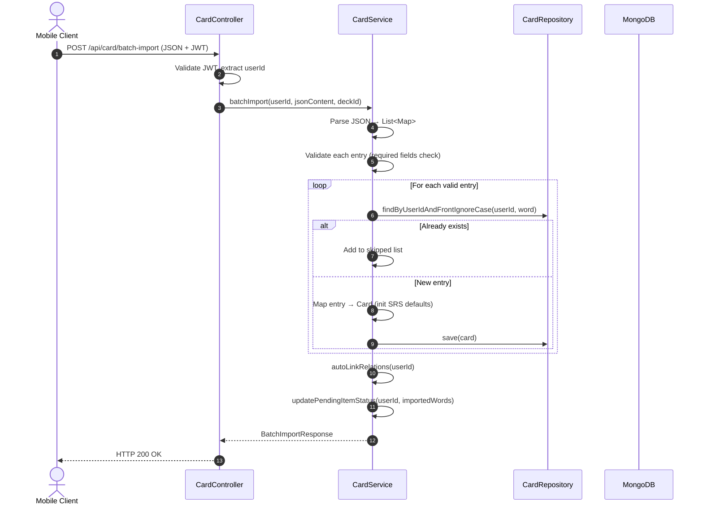
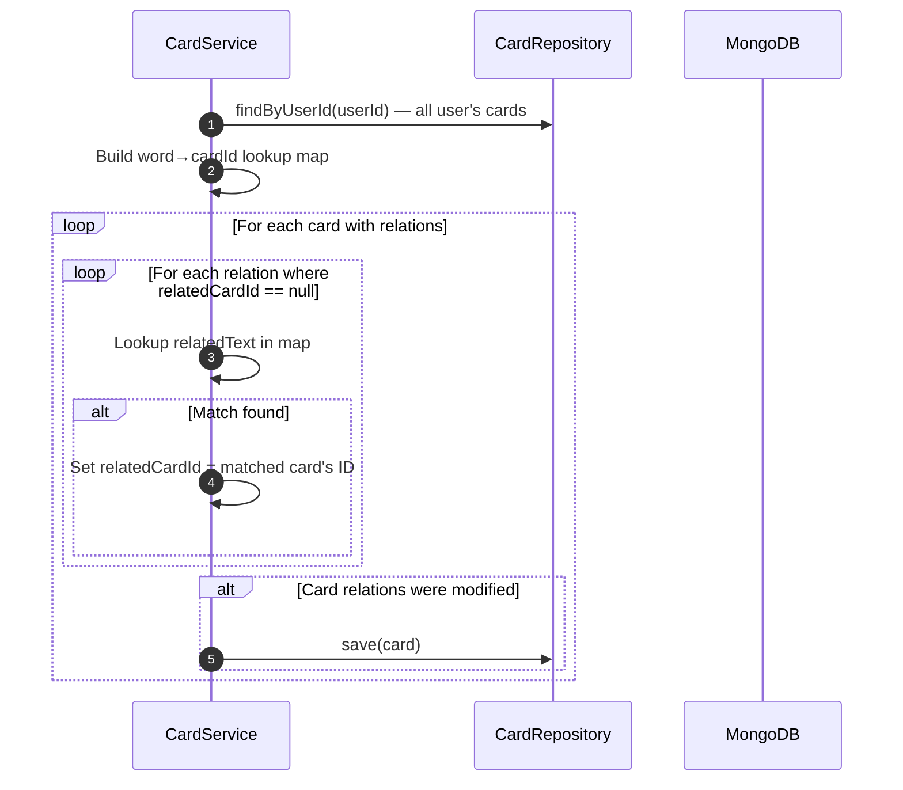
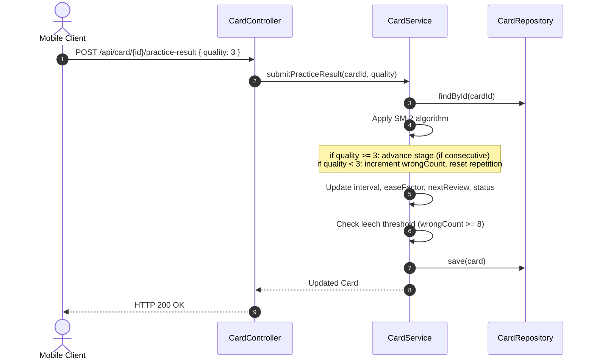

# Implementation Plan: Unified Vocabulary Learning System

> **Perspective**: Tech Lead / System Architect  
> **Purpose**: Answer the question **"HOW & ARCHITECTURE"**

---

## 1. Technical Context & Constraints
- **Package Base**: `mobile.*`
- **Architecture Pattern**: Clean Architecture + Package-by-Feature (`apis` → `businesses` → `databases`)
- **Database**: MongoDB (`@Document`, `ObjectId`, embedded documents)
- **Validation**: `@Valid`, `@NotBlank`, `@NotNull`, `@Min`, `@Max`
- **Security**: JWT Bearer Token, Spring Security Context
- **Boilerplate**: Lombok (`@Getter`, `@Setter`, `@NoArgsConstructor`, `@AllArgsConstructor`, `@Builder`)
- **Existing entities to evolve**: `Card.java`, `ExampleSentence.java`, `FamilyMember.java`, `WordFamily.java`, `Deck.java`

### 1.1 Migration Strategy (Existing → New)

The current `Card` entity already has SRS fields (`interval`, `easeFactor`, `repetition`, `lapses`, `nextReview`). The redesign **evolves** this entity rather than replacing it:

| Current Field | Action | New Field |
| :--- | :--- | :--- |
| `front` | Keep | Same — holds word or phrase (e.g., "decision" or "reach a decision") |
| `back` | Keep | Same — Vietnamese meaning |
| `ipa`, `audio`, `partOfSpeech` | Keep | Same (nullable — collocations may leave these null) |
| `collocations: List<String>` | **Remove** — migrated to `relations` | `relations: List<WordRelation>` |
| `synonyms: List<String>` | **Remove** — migrated to `relations` | `relations: List<WordRelation>` |
| `antonyms: List<String>` | **Remove** — migrated to `relations` | `relations: List<WordRelation>` |
| `wordFamily: WordFamily` | **Remove** — migrated to `relations` | `relations: List<WordRelation>` |
| `commonMistakes: List<String>` | Deprecate | Keep for backward compat, stop writing |
| `masteryStatus` | Rename | `status` (new/learning/mature/leech) |
| `level` | Deprecate | Replaced by `stage` + `status` |
| `interval`, `easeFactor`, `repetition`, `lapses` | Keep | Same |
| — | **Add** | `definitionEn` |
| — | **Add** | `usageNote` |
| — | **Add** | `topic` |
| — | **Add** | `stage` (0–5) |
| — | **Add** | `wrongCount` |
| — | **Add** | `seenExampleIds: List<String>` |
| `examples: List<ExampleSentence>` | **Evolve** | Add `formality` field |

> **No `entryType` field.** Words and collocations are treated identically — a collocation like "reach a decision" is simply a Card whose `ipa` and `partOfSpeech` happen to be null. Zero branching logic anywhere.

---

## 2. Data Model & MongoDB Collections

### 2.1 MongoDB Collection: `card` (Evolved)
- **Entity Class**: `mobile.model.Entity.Card.java`
- **Design**: Single unified document. No distinction between word types. Static content + SRS progress co-located for atomic updates.

| Field | Java Type | BSON Type | Constraints | Description |
| :--- | :--- | :--- | :--- | :--- |
| `id` | `ObjectId` | `ObjectId` | `@Id` | Primary key |
| `userId` | `ObjectId` | `ObjectId` | `@NotNull`, Indexed | Owner reference |
| `deckId` | `ObjectId` | `ObjectId` | Nullable, Indexed | Optional deck association |
| **— Static Content —** | | | | |
| `front` | `String` | `String` | `@NotBlank` | The word or phrase: "decision" or "reach a decision" |
| `back` | `String` | `String` | `@NotBlank` | Vietnamese meaning: "sự quyết định" |
| `ipa` | `String` | `String` | Nullable | IPA pronunciation |
| `partOfSpeech` | `String` | `String` | Nullable | POS tag |
| `definitionEn` | `String` | `String` | Nullable | English definition |
| `usageNote` | `String` | `String` | Nullable | Usage note |
| `topic` | `String` | `String` | Nullable | Topic tag: "business", "academic", etc. |
| `audio` | `String` | `String` | Nullable | Audio URL |
| `image` | `String` | `String` | Nullable | Image URL |
| `examples` | `List<ExampleSentence>` | `Array<Object>` | Embedded | Example sentences with formality |
| `relations` | `List<WordRelation>` | `Array<Object>` | Embedded | Unified family/collocation/synonym links |
| **— Personal & Tags —** | | | | |
| `tags` | `Set<String>` | `Array<String>` | Nullable | User-defined tags |
| `personalNote` | `String` | `String` | Nullable | User's personal note |
| `myExample` | `String` | `String` | Nullable | User's own example sentence |
| `isFavorite` | `boolean` | `Boolean` | Default `false` | Favorite flag |
| **— SRS Progress —** | | | | |
| `stage` | `int` | `Int32` | Default `0` | Practice stage (0–5) |
| `status` | `String` | `String` | Default `"new"` | `new` / `learning` / `mature` / `leech` |
| `interval` | `int` | `Int32` | Default `0` | Days until next review |
| `easeFactor` | `double` | `Double` | Default `2.5` | SM-2 ease factor |
| `repetition` | `int` | `Int32` | Default `0` | Consecutive correct count |
| `lapses` | `int` | `Int32` | Default `0` | Times forgotten |
| `wrongCount` | `int` | `Int32` | Default `0` | Cumulative wrong answers (for leech detection) |
| `reviewCount` | `int` | `Int32` | Default `0` | Total review sessions |
| `lastReviewed` | `Date` | `Date` | Nullable | Last review timestamp |
| `nextReview` | `Date` | `Date` | Nullable | Next scheduled review |
| `seenExampleIds` | `List<String>` | `Array<String>` | Default `[]` | Example IDs already used in exercises |
| **— Timestamps —** | | | | |
| `createAt` | `Date` | `Date` | `@CreatedDate` | Creation timestamp |
| `updateAt` | `Date` | `Date` | `@LastModifiedDate` | Last modified timestamp |

**Compound Index**: `{ userId: 1, front: 1 }` — unique per user, enables duplicate detection on import.

### 2.2 Embedded Document: `ExampleSentence` (Evolved)
- **Class**: `mobile.model.Entity.ExampleSentence.java`

| Field | Java Type | Description |
| :--- | :--- | :--- |
| `sentence` | `String` | Example sentence text |
| `translation` | `String` | Vietnamese translation (optional) |
| `formality` | `String` | `"formal"` / `"informal"` / `"written"` |
| `source` | `String` | Source attribution (optional) |

### 2.3 Embedded Document: `WordRelation` (NEW — replaces WordFamily, collocations, synonyms)
- **Class**: `mobile.model.Entity.WordRelation.java`

| Field | Java Type | Description |
| :--- | :--- | :--- |
| `relatedText` | `String` | The related word/phrase text: "decide", "make a decision" |
| `relationType` | `String` | `"family"` / `"collocation"` / `"synonym"` |
| `pos` | `String` | Part of speech (only for `family` type, e.g., "verb") |
| `relatedCardId` | `String` | Card ID if linked (null if not yet in DB). Stored as String for JSON flexibility. |

### 2.4 MongoDB Collection: `pending_item` (NEW)
- **Entity Class**: `mobile.model.Entity.PendingItem.java`

| Field | Java Type | BSON Type | Constraints | Description |
| :--- | :--- | :--- | :--- | :--- |
| `id` | `ObjectId` | `ObjectId` | `@Id` | Primary key |
| `userId` | `ObjectId` | `ObjectId` | `@NotNull`, Indexed | Owner |
| `content` | `String` | `String` | `@NotBlank` | "decisive" or "reach a decision" |
| `sourceType` | `String` | `String` | Nullable | `"family"` / `"collocation"` / `"synonym"` / `"manual"` |
| `sourceCardId` | `ObjectId` | `ObjectId` | Nullable | Which card spawned this suggestion |
| `status` | `String` | `String` | Default `"pending"` | `"pending"` / `"imported"` |
| `createdAt` | `Date` | `Date` | `@CreatedDate` | When added |

**Compound Index**: `{ userId: 1, content: 1 }` — unique, prevents duplicate pending items.

---

## 3. Package Structure & Clean Architecture Breakdown

```text
src/main/java/mobile/
├── model/Entity/                          # [LAYER 3: DATA / ENTITIES]
│   ├── Card.java                         # Evolved — add relations, stage, etc.
│   ├── ExampleSentence.java              # Evolved — add formality field
│   ├── WordRelation.java                 # NEW — replaces WordFamily/collocations/synonyms
│   ├── PendingItem.java                  # NEW — Word Collector pending queue
│   ├── Deck.java                         # Unchanged
│   ├── WordFamily.java                   # DEPRECATED (kept for backward compat)
│   └── FamilyMember.java                 # DEPRECATED (kept for backward compat)
│
├── repository/                            # [LAYER 3: DATA ACCESS]
│   ├── CardRepository.java              # Evolved — add new query methods
│   └── PendingItemRepository.java       # NEW
│
├── Service/                               # [LAYER 2: BUSINESS LOGIC]
│   ├── CardService.java                  # Evolved — batch import, auto-link, SRS
│   └── PendingItemService.java          # NEW
│
├── controller/                            # [LAYER 1: ADAPTER / CONTROLLER]
│   ├── CardController.java              # Evolved — new endpoints
│   └── PendingItemController.java       # NEW
│
├── model/payload/                         # [DTOs]
│   ├── request/
│   │   ├── BatchImportRequest.java      # NEW
│   │   ├── PracticeResultRequest.java   # NEW
│   │   └── CreatePendingItemRequest.java # NEW
│   └── response/
│       ├── CardDetailResponse.java      # NEW — includes reverse relations
│       ├── DashboardResponse.java       # NEW — stats + paginated cards
│       ├── BatchImportResponse.java     # NEW — imported/skipped/errors
│       └── PendingItemResponse.java     # NEW
```

> **Note**: The project currently uses `controller/` + `Service/` + `model/Entity/` + `repository/` package structure (not the ideal `apis/businesses/databases` from AGENTS.md). The redesign follows the **existing project conventions** to avoid a disruptive refactor.

---

## 4. Boundary Contracts & Key DTOs

### 4.1 Batch Import Request (via Controller)

```java
// POST /api/card/batch-import
@Getter @Setter @NoArgsConstructor @AllArgsConstructor
public class BatchImportRequest {
    @NotBlank
    private String jsonContent;   // Raw JSON string from AI
    private ObjectId deckId;      // Optional — assign to deck
}
```

### 4.2 Batch Import Response

```java
@Getter @Setter @NoArgsConstructor @AllArgsConstructor @Builder
public class BatchImportResponse {
    private List<Card> imported;       // Successfully created cards
    private List<String> skipped;      // Duplicate words (already exist)
    private List<ImportError> errors;  // Entries with validation failures
    
    @Getter @Setter @NoArgsConstructor @AllArgsConstructor
    public static class ImportError {
        private String word;
        private List<String> missingFields;
    }
}
```

### 4.3 Dashboard Response

```java
@Getter @Setter @NoArgsConstructor @AllArgsConstructor @Builder
public class DashboardResponse {
    private long totalCards;
    private long dueToday;
    private long matureCount;
    private long learningCount;
    private long leechCount;
    private long newCount;
    private Page<Card> cards;
}
```

### 4.4 Practice Result Request

```java
@Getter @Setter @NoArgsConstructor @AllArgsConstructor
public class PracticeResultRequest {
    @Min(0) @Max(5)
    private int quality;    // 0 = total blackout, 5 = perfect recall (SM-2 standard)
}
```

### 4.5 Create Pending Item Request

```java
@Getter @Setter @NoArgsConstructor @AllArgsConstructor
public class CreatePendingItemRequest {
    @NotBlank
    private String content;         // "decisive" or "reach a decision"
    private String sourceType;      // "family"/"collocation"/"synonym"/"manual" (nullable)
    private ObjectId sourceCardId;  // which card it came from (nullable)
}
```

---

## 5. Business Flow & Sequence Diagrams

### 5.1 Batch Import Flow



### 5.2 Auto-Link Flow



### 5.3 Practice Result / SRS Update Flow



---

## 6. API Endpoints Contract

### 6.1 Card Endpoints (Evolved)

| Method | Path | Description | Request | Response |
| :--- | :--- | :--- | :--- | :--- |
| `POST` | `/api/card/batch-import` | AI-powered batch import | `BatchImportRequest` | `BatchImportResponse` |
| `GET` | `/api/card/dashboard` | Dashboard with stats + filters | Query: `search`, `status`, `topic`, `deckId`, `page`, `size` | `DashboardResponse` |
| `GET` | `/api/card/{id}` | Card detail with reverse relations | — | `CardDetailResponse` |
| `GET` | `/api/card/practice/due` | Get due cards for practice session | Query: `limit` (default 15) | `List<Card>` |
| `POST` | `/api/card/{id}/practice-result` | Submit practice answer quality | `PracticeResultRequest` | `Card` (updated) |
| `POST` | `/api/card` | Create single card | `CreateCardRequest` | `Card` |
| `PUT` | `/api/card/{id}` | Update card | Partial card fields | `Card` |
| `DELETE` | `/api/card/{id}` | Delete card | — | `204 No Content` |
| `PUT` | `/api/card/{id}/toggle-favorite` | Toggle favorite | — | `Card` |
| `PUT` | `/api/card/{id}/move-deck` | Move to another deck | Query: `newDeckId` | `Card` |

### 6.2 Pending Item Endpoints (NEW)

| Method | Path | Description | Request | Response |
| :--- | :--- | :--- | :--- | :--- |
| `POST` | `/api/pending-item` | Add item to collector | `CreatePendingItemRequest` | `PendingItem` |
| `GET` | `/api/pending-item` | List user's pending items | Query: `status`, `page`, `size` | `Page<PendingItem>` |
| `DELETE` | `/api/pending-item/{id}` | Remove from collector | — | `204 No Content` |
| `GET` | `/api/pending-item/generate-prompt` | Generate AI prompt from pending items | — | `{ prompt: String }` |
| `POST` | `/api/pending-item/add-manual` | Manually type a word to add | `{ content }` | `PendingItem` |

---

## 7. SM-2 Algorithm Implementation

```java
public void applySM2(Card card, int quality) {
    // quality: 0-5 (0 = total blackout, 5 = perfect response)
    if (quality >= 3) {
        // Correct response
        if (card.getRepetition() == 0) {
            card.setInterval(1);
        } else if (card.getRepetition() == 1) {
            card.setInterval(6);
        } else {
            card.setInterval((int) Math.round(card.getInterval() * card.getEaseFactor()));
        }
        card.setRepetition(card.getRepetition() + 1);
    } else {
        // Incorrect response — reset
        card.setRepetition(0);
        card.setInterval(1);
        card.setWrongCount(card.getWrongCount() + 1);
    }
    
    // Update ease factor
    double ef = card.getEaseFactor() + (0.1 - (5 - quality) * (0.08 + (5 - quality) * 0.02));
    card.setEaseFactor(Math.max(1.3, ef));
    
    // Schedule next review
    card.setNextReview(addDays(new Date(), card.getInterval()));
    card.setLastReviewed(new Date());
    card.setReviewCount(card.getReviewCount() + 1);
    
    // Update status
    if (card.getWrongCount() >= 8) {
        card.setStatus("leech");
    } else if (card.getInterval() >= 21) {
        card.setStatus("mature");
    } else if (card.getRepetition() > 0) {
        card.setStatus("learning");
    }
}
```

---

## 8. Error Handling & HTTP Status Mapping

| Status | Condition |
| :--- | :--- |
| `200 OK` | Successful operation |
| `201 CREATED` | New resource created (pending item) |
| `204 NO CONTENT` | Successful delete |
| `400 BAD_REQUEST` | Validation failure, malformed JSON, invalid quality score |
| `401 UNAUTHORIZED` | Missing or expired JWT |
| `403 FORBIDDEN` | Accessing another user's cards |
| `404 NOT_FOUND` | Card or pending item not found |
| `409 CONFLICT` | Duplicate word in batch import (returned in `skipped` array, not an error) |
