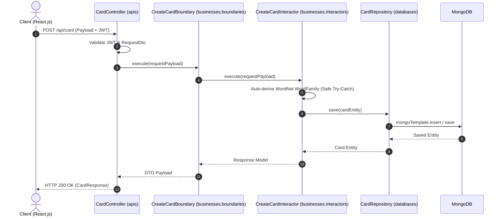

# Technical Implementation Plan: Combined Deck & Vocabulary Vault System

> **Perspective**: Solution Architect / Lead Developer  
> **Purpose**: Technical design adhering strictly to **Clean Architecture 3-Level Flow** defined in `AGENTS.md` and `docs/architecture.md`.

---

## 1. Technical Context & Package Breakdown

The system is organized into 3 Clean Architecture layers within `src/main/java/mobile/`:

```text
src/main/java/mobile/
├── apis/card/                           # [LAYER 1: ADAPTER / CONTROLLER]
│   ├── CardController.java              # Thin REST Controller
│   ├── CardMapper.java                  # Entity <-> DTO Mapping
│   └── dtos/
│       ├── CreateCardRequest.java
│       ├── CardResponse.java
│       └── CardReviewRequest.java
├── businesses/                          # [LAYER 2: BUSINESS LOGIC / USE-CASES]
│   ├── boundaries/card/
│   │   ├── GetUserCardsBoundary.java
│   │   ├── CreateCardBoundary.java
│   │   ├── BatchCreateCardsBoundary.java
│   │   └── ToggleFavoriteBoundary.java
│   └── interactors/card/
│       ├── GetUserCardsInteractor.java
│       ├── CreateCardInteractor.java
│       ├── BatchCreateCardsInteractor.java
│       └── ToggleFavoriteInteractor.java
└── databases/                           # [LAYER 3: DATA ACCESS / INFRASTRUCTURE]
    ├── entities/
    │   ├── Card.java                    # MongoDB Document
    │   ├── WordFamily.java
    │   └── FamilyMember.java
    └── repositories/
        └── CardRepository.java          # Spring Data Mongo Repository
```

---

## 2. Data Model & MongoDB Collections (`Card.java`)

```java
@Document(collection = "card")
public class Card {
    @Id
    protected ObjectId id;
    protected ObjectId userId;
    protected ObjectId deckId;          // Optional (Nullable)
    protected String front;
    protected String back;
    @JsonProperty("ipa")
    protected String ipa;
    protected String audio;
    protected String partOfSpeech;
    protected String level;
    protected List<ExampleSentence> examples;
    protected List<String> collocations;
    protected WordFamily wordFamily;
    @JsonProperty("isFavorite")
    protected boolean isFavorite = false;
    protected String masteryStatus = "NEW";
}
```

---

## 3. Sequence Flow (Clean Architecture 3-Way Flow)



---

## 4. API Endpoints Contract

- `GET /api/card/user/{userId}`: `Page<CardResponse>`
- `POST /api/card`: `CardResponse`
- `POST /api/card/batch`: `List<CardResponse>`
- `PUT /api/card/{id}/toggle-favorite`: `CardResponse`
- `PUT /api/card/{id}/move-deck?newDeckId=xxx`: `CardResponse`
